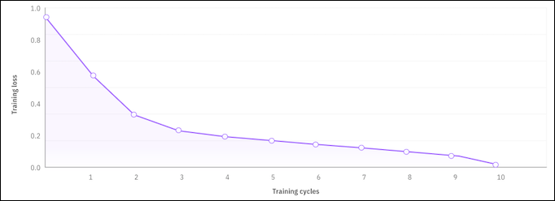

---
copyright:
  years: 2023, 2025
lastupdated: "2025-05-30"

keywords: watsonx, model, llm, ansible

subcollection: watsonx-code-assistant
content-type: tutorial
completion-time: 60m
---

{{site.data.keyword.attribute-definition-list}}

# Tuning the IBM base code model for {{site.data.keyword.wcaal_short}}
{: #tutorial-tune-ansible}
{: toc-content-type="tutorial"}
{: toc-completion-time="60m"}

[Red Hat Ansible Lightspeed]{: tag-red}
[Standard plan]{: tag-purple}

If you purchased a [{{site.data.keyword.wcaal_short}} Standard plan](/docs/watsonx-code-assistant?topic=watsonx-code-assistant-ansible-pricing#standard-plan), you can tune the IBM base code model on your data so that it generates code suggestions that are customized for your enterprise standards. You can use the {{site.data.keyword.wcaal_short}} tuning studio to create model experiments and deploy your models to shared spaces so you and your team can quickly generate reliable and accurate code.
{: shortdesc}

## Create a tuning experiment and upload your tuning data
{: #code-assist-experiment}

Before you can tune the model on your Ansible data, you must convert your Ansible files to JSONL format by using the Red Hat Ansible content parser tool. This tool analyzes Ansible files in a local directory, GitHub repository, or an archive file and generates a JSONL file that is the tuning data set for tuning your model. For more information, see [Configuring custom models](https://docs.redhat.com/en/documentation/red_hat_ansible_lightspeed_with_ibm_watsonx_code_assistant/2.x_latest/html/red_hat_ansible_lightspeed_with_ibm_watsonx_code_assistant_user_guide/set-up-lightspeed_lightspeed-user-guide#configuring-custom-models_set-up-lightspeed){: external}.

To improve your model accuracy, provide at least 1000 samples in your JSONL file. A sample consists of an input (the context and the task name) and an output (the expected model output). For more information about verifying that your sample is well-formed, click **example of a sample** in **Prepare your data**.
{: important}

1. On the welcome page for your {{site.data.keyword.wca_short}} instance, click **Tune a model** and select a project from the menu.

   This option opens a simplified version of the watsonx Tuning Studio that is customized for {{site.data.keyword.wcaal_short}}.

1. Provide a meaningful name and description for your experiment so you can easily identify the model after you deploy it.

1. Click **Create a tuning experiment**. The data upload page opens.

1. Upload your tuning data in JSONL format.

1. Compare your data with the training data for the IBM base code model.

   After the file uploads, you can compare your data with the data for the IBM base code model data. This comparison shows you what modules from your data are not present in the base model data. Your model is tuned on these modules to improve the accuracy of code suggestions.

   - Click the eye icon by your JSONL file name to view your raw JSONL data.
   - Click the linked number of your **Ansible module count** to view metric details about your modules and samples. You can also see the differences and similarities between your experiment and the IBM base code model data.
   - Click the linked number of your **Unique Ansible modules count** to view the unique modules that are not represented in the IBM base code module. This screen also displays the percentage of the overall unique module count that each module comprises.

   All this information helps you understand how code suggestions might improve after the model is tuned. Training data that includes many unique modules has the potential to substantially improve code suggestions for modules that the IBM base code module was not initially trained on.

## Tune your model
{: #model-tune}

1. Click **Start tuning**.

   The tuning process starts. The progress indicator lists the elapsed time of your tuning.

   Customization takes time, especially with large quantities of samples. This step might take hours, not minutes.
   {: note}

   When your tuning job completes, you can see an assessment of the training loss of your tune. The training loss is a measure of how much a code suggestion diverges from the expected code suggestion. Typically, the training loss decreases as the number of tuning cycles increases. Look for a downward-sloping curve, which indicates that the model got better at generating the expected outputs across successive training cycles.

{: caption="Training loss graph for tuned model"}

## Deploy your model and obtain your model ID
{: #code-assist-deploy}

Now that you see the difference that your experiment can make, you can deploy it and obtain the corresponding model ID for use in Visual Studio Code.

1. Click **Deploy tuned model**.

1. Specify a meaningful name and description for your deployment.

1. Choose the deployment space for your model.

1. Click **Create**.

   After your deployment is complete, the overview page for your model opens.

1. Click the copy icon for your Model ID to copy the value.

## Optional: Test your model in your local Visual Studio Code instance
{: #code-assist-test}

You can test your model locally before you make it available to others in your organization.

1. Open the settings for your Ansible Lightspeed for Visual Studio Code extension.

1. Copy your Model ID into the **Ansible > Lightspeed: Model ID Override** field.

   You can now get code recommendations from your tuned model to test the accuracy of the model before you roll it out to your organization.

## Make your tuned model available to others in your organization
{: #code-assist-rollout}

When you're satisfied with your tuned model, you can add the Model ID to the Ansible Lightspeed Admin Portal to make it available to authorized users in your organization.

1. On the overview page for your tuned model, click **Open Ansible Lightspeed Admin Portal**.
1. Activate your model by pasting your Model ID value into the specified field in the Ansible Lightspeed Admin Portal.

   Activating your model enables it for your authorized users in the Ansible Lightspeed for VS Code extension.
