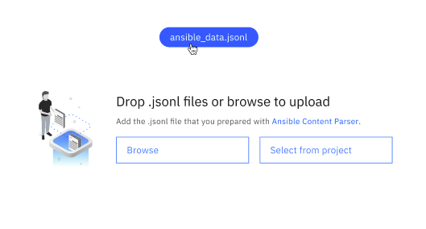

---

copyright:
   years: 2023
lastupdated: "2023-10-05"

keywords: watsonx, model, llm, ansible

subcollection: watson-code-assistant

---

{{site.data.keyword.attribute-definition-list}}

# Customizing IBM base code models for watsonx Code Assistant for Ansible
{: #tutorial-tune-ansible}

After you provision your instance of {{site.data.keyword.wcaal_full}}, you can get started customizing your model by working through the watsonx Code Assistant Customization Studio. The watsonx Code Assistant Customization Studio enables you to create model experiments and deploy your models to shared spaces for your team to take advantage of.
{: shortdesc}

At the end of this task, you obtain the model ID that you need to enter in Visual Studio Code for Red Hat Ansible Lightspeed. For more information about setting up Red Hat Ansible Lightspeed, see [LINK TO RH DOCS](https://docs.ai.ansible.redhat.com/).

## Prerequisites
{: #tune-ansible-prereqs}

* [Acquire and deploy your watsonx Code Assistant instance](./getting-started.md)

## Start watsonx Code Assistant Customization Studio
{: #code-assist-studio-launch}
{: step}

First, you must log in to IBM Cloud and access the instance of watsonx Code Assistant that you created in the getting started flow. After you're in, you can start customizing the IBM base code model to better suit your needs.

1. Sign in to your {{site.data.keyword.cloud_notm}} dashboard, then click the navigation menu icon, then select watsonx Code Assistant. The watsonx Code Assistant dashboard opens.
2. Click **watsonx Code Assistant Customization Studio** to start the Customization Studio app. This is where you can create your experiments and deploy your customized models for your teams.
3. Click **Customize code model** > **Project: Model customization**.

You'll now be on the **Customize code model** page, and you're now ready to start customizing!

## Create an experiment
{: #code-assist-experiment}
{: step}

The next step in the process of customizing and deploying a model is getting your data ready and feeding it into the IBM base code model as an *experiment*. Experiments are data models that have been customized but not deployed and that you can assess their potential effectiveness in the Customization Studio. There are several options along this path (and some opportunities to take deeper dives into what you're doing), but by the end of these steps, you are ready to deploy your model and get your model ID for input in Visual Studio Code.

1. (Optional) Click **IBM base code model for Ansible** to read more about the base model that you're going to customize. This information includes details about the model itself, its intended use, and limitations.
2. Provide a meaningful **Name** and **Description** for your experiment. After you deploy your model, this is going to be the easiest way for you to quickly identify your model afterwards. Avoid generic names, like `Tuning experiment`.`
3. Click **Create experiment**. The data upload page opens.
4. Upload your data (in JSONL format) that you want to customize the model with. You can either drop your file into the drop area on the page, or click **Browse** or **Select from project** to find the file locally, or pull it from an existing watsonx project accordingly. For more information about formatting your sample, see [NEED LINK](https://docs.ai.ansible.redhat.com/) in the Red Hat Ansible content parser tool documentation.

   To improve your model's accuracy, you need to provide at least 1000 samples (Red Hat Ansible inputs and outputs). For more information about ensuring that your sample is well-formed, click **View sample**.
   {: important}

5. Click your uploaded file to start comparing your data to the base model. The **Compare you data with the IBM base data** page opens.

   {: caption="Clicking on your uploaded file to start comparing your data"}

6. You can start to get a feel for how effective your experiment will be from the **Compare your data with the IBM base data** page. There are three types of information that you can see:

   * Click the eye icon by your JSONL file name to view your raw JSONL data.
   * Click the linked number of your *Ansible module count* to view metric details about your modules and samples and the differences and similarities between your experiment and the IBM base code model data.
   * Click the linked number of your *Unique Ansible modules count* to view the unique number of samples from your data.

   All of this information can contribute to getting a feeling for how effective your customization will be.

   After you've assessed that data, click **Start customization** to start customizing the data model. The **Model customization** page opens.

7. Completing the previous step starts the customization process. You'll see a progress indicator listing the elapsed time of your customization. 

   Customization takes time, especially with large quantities of samples. This step might take hours, not minutes.
   {: note}

   When your customization job completes, you will see an assessment of the error rate of your customization job. This is also commonly referred to as a *loss function graph*. Your error rate graph illustrates the potential improvement in the model output over time. Epochs are shown on the x-axis and the difference between predicted and actual results per epoch is shown on the y-axis. A downward-sloping curve indicates that the model gets better at generating the expected outputs in the expected format over time.

   Click **Deploy customized model** > **Deploy** to turn your experiment into a reality.

## Deploy your model and obtain your model ID
{: #code-assist-deploy}
{: step}

Now that you're happy with the difference your experiment will make, you can deploy it and obtain the corresponding model ID for use in Visual Studio Code.

1. Now that your experiment is no longer an experiment, you must provide a meaningful name and description for your deployed model so that anybody in your space who uses it through {{site.data.keyword.wca_full_notm}} can identify it.
2. Select **View deployment in deployment space after creating**. This is the screen where you can find your model ID. For existing models, you can find their model IDs also in the properties of those models in the deployment space.
3. Click **Deploy**. If you selected **View deployment in deployment space after creating** in the previous step, the model deployment page opens.
4. Click **Model ID** to see the model ID. You can click the copy icon to paste the model ID to your clipboard.
5. Click **Open Ansible Lightspeed Admin Portal** to open up the Ansible Lightspeed Admin Portal where you can paste that model ID.

You have now deployed and paired your model to your {{site.data.keyword.wcaal_full_notm}} instance and can start reaping the benefits of using {{site.data.keyword.wca_full_notm}}.

## Get cracking with Ansible Lightspeed!
{: #cd-kube-step-next}

For more information about using {{site.data.keyword.wcaal_full_notm}}, see [NEED LINK](https://docs.ai.ansible.redhat.com/).
