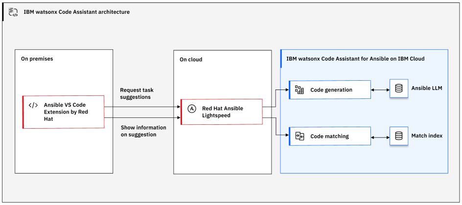

---

copyright:
   years: 2023, 2024
lastupdated: "2024-03-28"

keywords:

subcollection: watsonx-code-assistant

---

{{site.data.keyword.attribute-definition-list}}

# {{site.data.keyword.wca_short_cap}} architecture
{: #architecture}

The architecture that your instance relies on depends on the use case that you implement.
{: shortdesc}

## {{site.data.keyword.wcaal_short}} architecture
{: #architecture-a}

[{{site.data.keyword.wcaal_short}}]{: tag-red}

The following architectural diagram illustrates the architecture of the {{site.data.keyword.wcaal_short}} use case.

{: caption="Architectural diagram for {{site.data.keyword.wcaal_short}}"}

## {{site.data.keyword.wcaz_short}} architecture
{: #architecture-z}

[{{site.data.keyword.wcaz_short}}]{: tag-blue}

For more information about the {{site.data.keyword.wcaz_short}} use case architecture, see [Solution architecture](https://www.ibm.com/docs/en/watsonx-code-assistant-4z/latest?topic=overview-solution-architecture){: external}.

