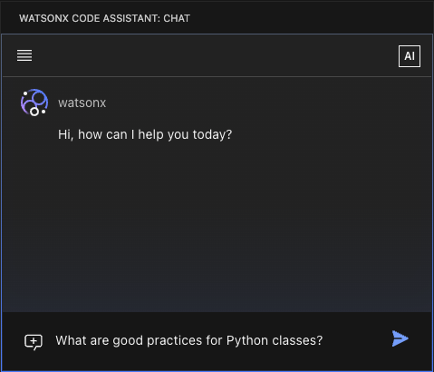
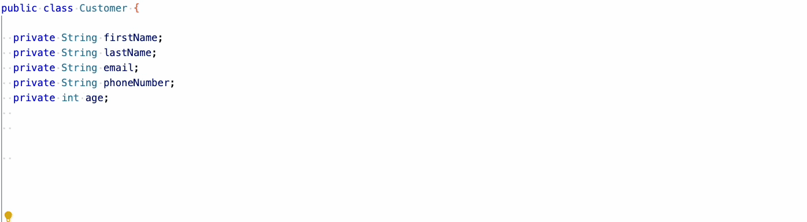
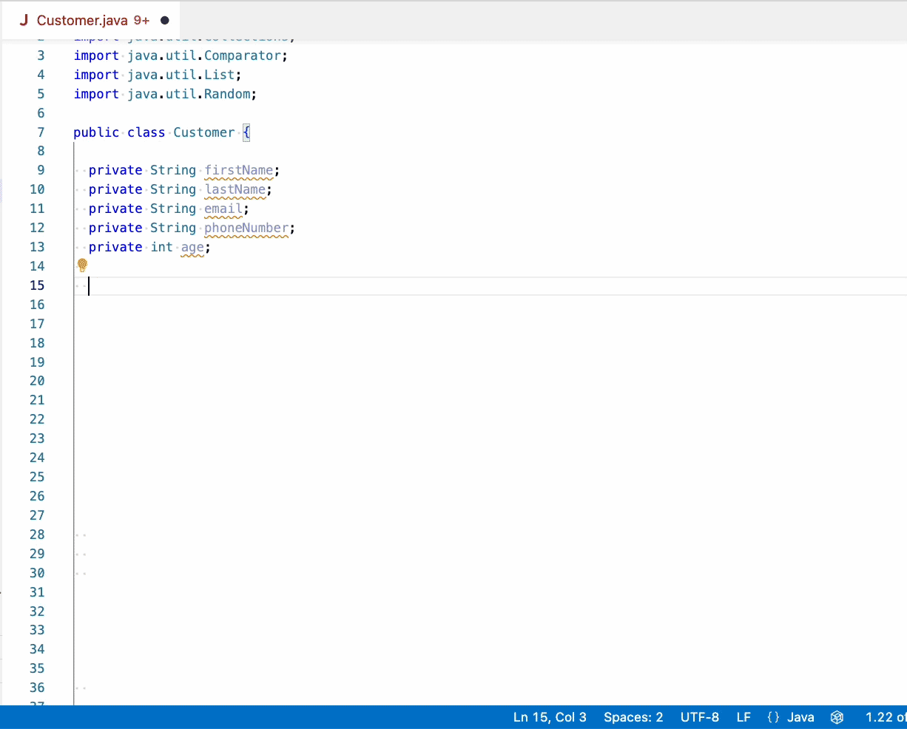
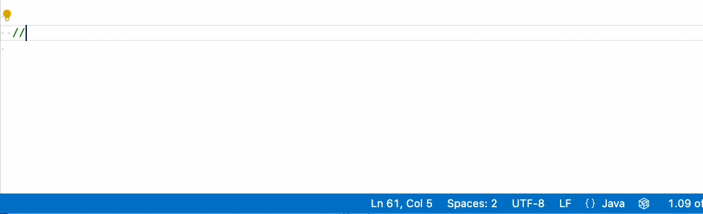

---

copyright:
  years: 2023, 2025
lastupdated: "2025-07-21"

keywords: FAQ, Ansible, Red Hat, Z

subcollection: watsonx-code-assistant

content-type: faq

---

{{site.data.keyword.attribute-definition-list}}

# FAQ for {{site.data.keyword.wca_short}}
{: #my-service-faqs}

Frequently asked questions about {{site.data.keyword.wca_short}}.
{: shortdesc}

## What is {{site.data.keyword.wca_short}}?
{: #wca-faq-what-is-wca}
{: faq}

{{site.data.keyword.wca_full}} is an innovative, generative AI coding companion that offers robust, contextually aware assistance for popular programming languages that include Go, C, C++, Java, JavaScript, Python, TypeScript, and more. Seamlessly integrated into your IDE, you can accelerate your productivity and simplify coding tasks, all with trust, security, and compliance.

## How does {{site.data.keyword.wca_short}} integrate with my current development environment? 
{: #wca-faq-integrate}
{: faq}

IBM {{site.data.keyword.wca_short}} seamlessly integrates with popular development environments like Visual Studio Code and Eclipse, so you can use your existing workflow.

For more information, see the documentation for your IDE:
- [Installing the extension for Visual Studio Code](/docs/watsonx-code-assistant?topic=watsonx-code-assistant-cloud-setup-wca-vscode)
- [Installing the plug-in for the Eclipse IDE](/docs/watsonx-code-assistant?topic=watsonx-code-assistant-cloud-setup-wca-eclipse)

## What coding tasks can I do with {{site.data.keyword.wca_short}}?
{: #wca-faq-features}
{: faq}

You can use {{site.data.keyword.wca_short}} to:
- [Get code suggestions](#wca-faq-features-code-suggestions)
- [Explain code](#wca-faq-features-explain-code)
- [Document code](#wca-faq-features-document-code)
- [Generate unit tests](#wca-faq-features-unit-test)
- [Translate code from one language to another](#wca-faq-features-translate-code)
- [Get answers from IBM documentation](#wca-faq-features-ibm-docs)

### How do I get code suggestions?
{: #wca-faq-features-code-suggestions}
{: faq}

**Use chat conversations**: Use natural language prompts to generate code suggestions. Use a chat conversation to enter a prompt that explains the code you need, and {{site.data.keyword.wca_short}} generates something you can choose to use. 

{: caption="Use chat conversations"}

**Reference code**: To ask questions or refine a specific file, class, function, or method in your workspace, you can use a code reference. These references provide important context and can help to increase the accuracy of the answer. As part of your chat message, type the `@` symbol to see a list of files, classes, and methods from your workspace. Click to select the reference, and {{site.data.keyword.wca_short}} sends the contents of the reference as part of your message.

{: caption="Reference code"}

**Code completion**: Or, complete code in the editor. Start typing a line of code, then pause. {{site.data.keyword.wca_full_notm}} adds a code suggestion to complete the line that you typed. 

{: caption="Code completion"}

You can also get a multiline code suggestion. Start typing a line of code, then use a keyboard shortcut, and {{site.data.keyword.wca_short}} adds a multiline code suggestion.

{: caption="Multiline code completion"}

Or, enter a comment that describes the code you want. 

{: caption="Comment-to-code generation"}

For more information, see the documentation for [Getting code suggestions](/docs/watsonx-code-assistant?topic=watsonx-code-assistant-wca-generate-code).

### How do I get a code explanation?
{: #wca-faq-features-explain-code}
{: faq}

Use generative AI to analyze and summarize your code to understand what the code does. Click the **Explain** option that precedes a code block or enter `/explain` in a chat conversation. IBM {{site.data.keyword.wca_short}} analyzes the code and provides a detailed explanation of what the code does.

For more information, see the documentation for [Explaining code](/docs/watsonx-code-assistant?topic=watsonx-code-assistant-wca-explain).

### How do I add code documentation?
{: #wca-faq-features-document-code}
{: faq}

Generate comment lines that document what your code does. Click the **Document** option that precedes a code block or enter `/document` in a chat conversation. IBM {{site.data.keyword.wca_short}} analyzes the code and adds comments that document what the code does.

For more information, see the documentation for [Documenting code](/docs/watsonx-code-assistant?topic=watsonx-code-assistant-wca-generate-doc). 

### How do I generate unit tests?
{: #wca-faq-features-unit-test}
{: faq}

Create unit tests to evaluate your code functions. Click the **Unit Test** option that precedes a code block or enter `/unit-test` in a chat conversation. IBM {{site.data.keyword.wca_short}} analyzes the code and creates a unit test.

For more information, see the documentation for [Generating unit tests](/docs/watsonx-code-assistant?topic=watsonx-code-assistant-wca-generate-test). 

### How do I translate code from one language to another?
{: #wca-faq-features-translate-code}
{: faq}

Use {{site.data.keyword.wca_short}} to translate code. In a chat conversation, use the syntax `translate [from <source language >] to <target_language> <code reference>`

For more information, see the documentation for [Translating code from one language to another](/docs/watsonx-code-assistant?topic=watsonx-code-assistant-wca-translate-code).

### How do I get answers from IBM documentation?
{: #wca-faq-features-ibm-docs}
{: faq}

Use chat to ask questions that reference IBM and Red Hat product documentation. 

The chat syntax is:
`/docs [collection:<collection_name>] <your question>`

The `collection_name` is optional. If no collection is specified, `ibm_docs` is used.

Available documentation collections are:

| Collection | Source | URL reference |
| --- | --- | --- |
| `ibm_docs` | IBM Documentation | https://www.ibm.com/docs |
| `cloud_docs` | IBM Cloud Docs | https://cloud.ibm.com/docs/ |
| `redhat` | Red Hat Documentation | https://docs.redhat.com/products |
| `ibm_redbooks` | IBM Redbooks publications | https://www.redbooks.ibm.com/ |
| `support_docs` | IBM Support content | https://www.ibm.com/support/ |
| `general_technical_docs` | IBM Research and SecurityIntelligence | https://research.ibm.com/ and https://securityintelligence.com/articles |
{: caption="Documentation collections" caption-side="bottom"}

For more information, see the documentation for [Getting answers from IBM documentation](/docs/watsonx-code-assistant?topic=watsonx-code-assistant-wca-ibm-docs)

## What are the built-in commands that I can use when I write prompts?
{: #wca-faq-chat-commands}
{: faq}

Use these built-in commands to start or construct a prompt:

| Command | Description | For more information |
| --- | --- | --- |
| `@` | Reference code in your workspace | [Referencing code in your workspace](/docs/watsonx-code-assistant?topic=watsonx-code-assistant-wca-generate-code#wca-generate-code-reference-code) |
| `/document` | Generate documentation for a referenced file or a method or a class in the active workspace | [Generating documentation](/docs/watsonx-code-assistant?topic=watsonx-code-assistant-wca-generate-doc#wca-generate-doc-chat-command) |
| `/docs` | Ask questions that reference IBM and Red Hat product documentation | [Getting answers from IBM documentation](/docs/watsonx-code-assistant?topic=watsonx-code-assistant-wca-ibm-docs) |
| `/explain` | Use generative AI to analyze and summarize your code to understand what the code does | [Explaining code](/docs/watsonx-code-assistant?topic=watsonx-code-assistant-wca-explain#wca-explain-command) |
| `/help` | Get quick assistance about tasks | Type `/help` in the chat |
| `/unit-test` | Generate unit tests for various programming languages | [Generating unit tests](https://test.cloud.ibm.com/docs/watsonx-code-assistant?topic=watsonx-code-assistant-wca-generate-test#wca-gen-chat) |
| `/translate` | Translate code from one language to the other | [Translating code](/docs/watsonx-code-assistant?topic=watsonx-code-assistant-wca-translate-code) |
{: caption="Chat commands" caption-side="bottom"}

## Can I modernize or upgrade Enterprise Java applications?
{: #wca-faq-enterprise-java}
{: faq}

[Standard plan]{: tag-purple}

For use with the Standard plan, {{site.data.keyword.wcaej_full_notm}} adds features for Java application upgrades and modernization, and enhanced code explanation, unit test generation, and fixing Java unit tests.

### Java runtime modernization
{: #wca-faq-enterprise-java-modernize}
{: faq}

Analyze your Java application runtime and modernize it to a more lightweight, flexible, and efficient runtime. Receive a prescriptive plan that describes the changes that are needed to modernize your application, with a detailed assessment of complexity and required development effort. Use automation to quickly implement code and configuration changes. Transform code with generative Al assistance to resolve more complex issues.

For more information, see the documentation for [Modernizing Java applications](/docs/watsonx-code-assistant?topic=watsonx-code-assistant-wca-modernize-java).

### Java version upgrade
{: #wca-faq-enterprise-java-upgrade}
{: faq}

Identify changes required to upgrade Java code, automatically apply fixes, and use generative AI to transform Java code. Receive a prescriptive plan that describes the changes that are needed to upgrade your application, with a detailed assessment of complexity and required development effort. Use automation to quickly implement code and configuration changes. Transform code with generative Al assistance to resolve more complex issues.

For more information, see the documentation for [Upgrading the Java version for your application](/docs/watsonx-code-assistant?topic=watsonx-code-assistant-wca-upgrade-java).

### Explain Java applications
{: #wca-faq-enterprise-java-explain-app}
{: faq}

With the Standard plan, you can generate an explanation of your Java application. For more information, see the documentation for [Explaining Java applications](/docs/watsonx-code-assistant?topic=watsonx-code-assistant-wca-explain#wca-explain-apps).

### Generate and fix Java unit tests
{: #wca-faq-enterprise-java-unit-test}
{: faq}

Use generative AI to create tests that help maintain critical application functions. With the Standard plan, create enhanced unit tests to evaluate your code functions. You can also use generative AI to fix Java unit tests. 

For more information, see the documentation for [Generating unit tests](/docs/watsonx-code-assistant?topic=watsonx-code-assistant-wca-generate-test) and [Fixing unit tests](https://cloud.ibm.com/docs/watsonx-code-assistant?topic=watsonx-code-assistant-wca-generate-test#wca-generate-test-fix).

## How does {{site.data.keyword.wca_short}} differentiate between similar code contexts to avoid incorrect suggestions?
{: #wca-faq-differentiate}
{: faq}

{{site.data.keyword.wca_full_notm}} uses context-aware generation, meaning it analyzes surrounding code, function names, parameters, and even previous edits to tailor suggestions. This minimizes out-of-context completions and improves relevance, especially in complex or multi-module applications.

## How scalable is {{site.data.keyword.wca_short}} for larger projects or teams?
{: #wca-faq-scalable}
{: faq}

{{site.data.keyword.wca_full_notm}} is available in both on-premises and on SaaS models that provide you with the flexibility you need. It's highly scalable and suitable for individual developers and large teams that work on complex projects.

For more information, see the documentation:
- [SaaS: Setting up your {{site.data.keyword.wca_short}} service in IBM Cloud](/docs/watsonx-code-assistant?topic=watsonx-code-assistant-cloud-setup-wca)
- [On-premises: {{site.data.keyword.wca_short}} on IBM Software Hub](https://www.ibm.com/docs/en/software-hub/latest?topic=services-watsonx-code-assistant){: external}

## What security features does {{site.data.keyword.wca_short}} include to help ensure the safety and integrity of my code?
{: #wca-faq-security}
{: faq}

IBM {{site.data.keyword.wca_short}} is built on IBM Granite models and includes robust security features, such as IP indemnity, code similarity checks, and hardware-accelerated transparent memory encryption to protect your organization's intellectual property and help ensure code integrity.

### Where are my chat conversations stored?
{: #wca-faq-chat-storage}
{: faq}

{{site.data.keyword.wca_full_notm}} stores all your chat conversations locally in your file system under `<your home directory>/.wca/chat.db`, in a database format defined by [SQLite](https://www.sqlite.org/index.html){: external}. {{site.data.keyword.wca_full_notm}} does _not_ share these conversations with anyone. This file is not encrypted, other than the encryption that your file system provides. Safeguard this file against improper access.

### Does {{site.data.keyword.wca_short}} collect telemetry data?
{: #wca-faq-telemetry}
{: faq}

IBM watsonx Code Assistant does _not_ collect any telemetry data. In general, {{site.data.keyword.wca_short}} does not send any data that it processes to a third party, IBM included.

## What are the pricing plans, and what does each plan include?
{: #wca-faq-pricing}
{: faq}

IBM offers flexible pricing plans, including subscription-based options for different budgetary needs. Refer to the plan listings in the [IBM Cloud catalog](https://cloud.ibm.com/catalog/services/ibm-watsonx-code-assistant).

## Which programming languages are supported by {{site.data.keyword.wca_short}}? 
{: #wca-faq-language-support}
{: faq}

{{site.data.keyword.wca_full_notm}} supports 116 programming languages, including Python, Java, C, C++, Go, JavaScript, and TypeScript.

## How does {{site.data.keyword.wca_short}} support enterprise innovation at scale?
{: #wca-faq-innovation}
{: faq}

By removing routine friction in the development process, like writing boilerplate, onboarding new devs, and maintaining code quality, {{site.data.keyword.wca_short}} enables teams to focus more on business logic and experimentation. 

## How does {{site.data.keyword.wca_short}} maintain code consistency across a distributed development team?
{: #wca-faq-code-consistency}
{: faq}

{{site.data.keyword.wca_full_notm}} promotes consistency by generating code that is aligned with shared organizational patterns, such as naming conventions, architecture standards, and commenting styles. By grounding {{site.data.keyword.wca_short}} with your team’s existing repositories and by using {{site.data.keyword.wca_short}} within IDEs integrated with version control systems, teams can reduce mistakes and rework during code reviews.

## What data sources are used to train the {{site.data.keyword.wca_short}} models?
{: #faq-data-sources}
{: faq}

The {{site.data.keyword.wca_short}} models gather training data from various sources depending on which platform it's supporting. For more information, see [{{site.data.keyword.wca_full_notm}} model details](/docs/watsonx-code-assistant?topic=watsonx-code-assistant-wca-model-details)

## Can I provide feedback about the models?
{: #faq-provide-feedback}
{: faq}

You can provide feedback on your experiences, including suggestions for when your results don't match your expectations. For more information about providing feedback, see the [IBM Data and AI Ideas Portal for Customers](https://ibm-data-and-ai.ideas.ibm.com/){: external}.
