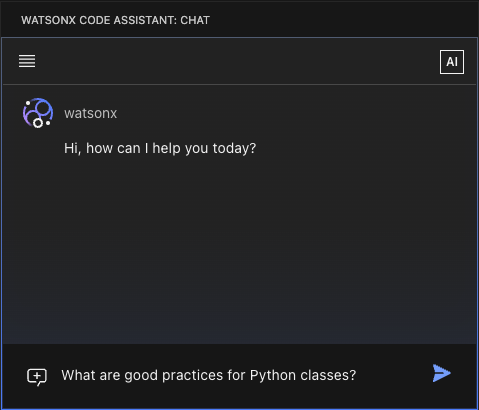

---

copyright:
   years: 2023, 2025
lastupdated: "2025-08-15"

keywords:

subcollection: watsonx-code-assistant

---

{{site.data.keyword.attribute-definition-list}}

# Overview of {{site.data.keyword.wca_short}}
{: #getting-started}

{{site.data.keyword.wca_full_notm}} is a portfolio of purpose-built, generative AI-assisted products that accelerate code and content generation and increase developer productivity, with trust, security, and compliance at its core. It provides models based on specific programming languages to provide trust and efficiency for accurate code and content generation.
{: shortdesc}

## {{site.data.keyword.wca_full_notm}}: Harness generative AI and advanced automation to create enterprise-ready code
{: #getting-started-wca}

[{{site.data.keyword.wca_short}}]{: tag-blue}

{{site.data.keyword.wca_full_notm}} is an innovative, generative AI coding companion that offers robust, contextually aware assistance for popular programming languages, including Go, C, C++, Java, JavaScript, Python, TypeScript, and more. Seamlessly integrated into your IDE, you can boost productivity and simplify coding tasks, all with trust, security, and compliance.

- **AI-powered coding tasks**: Code generation, explanation, unit test, creation, AI-derived code documentation, and more.
- **Chat for code**: Natural language AI conversational chat for planning applications and writing code.
- **Prebuilt chat commands**: Use optimized prompts for specific tasks.
- **Integrated directly into IDEs**: Available directly within Visual Studio Code and Eclipse, integrating seamlessly with your workflow.
- **Enterprise Java modernization**: Generative AI and automation-assisted modernization for Java enterprise applications (requires the Standard plan).
- **Retrieval-augmented generation**: Enhances response quality of user queries in relevant, up-to-date context from code bases and documentation (requires the Standard plan).

### Overview video
{: #getting-started-wca-video}

Watch YouTuber **Tech With Lucy** demonstrate {{site.data.keyword.wca_short}} in the overview video [How to build technical projects faster using AI](https://www.youtube.com/watch?v=88mzHgXaXvk){: external}.

### {{site.data.keyword.cloud_notm}}
{: #getting-started-wca-cloud}

To get started:
1. [Set up your {{site.data.keyword.wca_short}} service in {{site.data.keyword.cloud_notm}}](/docs/watsonx-code-assistant?topic=watsonx-code-assistant-cloud-setup-wca)
1. [Install the IDE extension or plug-in](/docs/watsonx-code-assistant?topic=watsonx-code-assistant-cloud-setup-wca-extensions)

| IBM Cloud plan | Description |
| --- | --- |
| [Trial plan]{: tag-magenta} | Limited no-cost trial with integrated generative AI chat for code |
| [Essentials plan]{: tag-green} | Integrated generative AI for code suggestions, code explanations, code documentation, and unit tests |
| [Standard plan]{: tag-purple} | All the features of the Essentials plan, plus enterprise Java modernization capabilities, enhanced code explanation, and enhanced unit test generation |
{: caption="IBM Cloud plans" caption-side="bottom"}

For complete plan details, see:
- [Pricing plans](https://www.ibm.com/products/watsonx-code-assistant/pricing){: external}
- [IBM Cloud catalog](https://cloud.ibm.com/catalog/services/ibm-watsonx-code-assistant){: external}.

### On-premises
{: #getting-started-wca-on-prem}

You can also use IBM Software Hub to install {{site.data.keyword.wca_short}} as an on-premises service at your organization. For more information, see the [IBM Software Hub documentation](https://www.ibm.com/docs/en/software-hub/5.1.x?topic=services-watsonx-code-assistant){: external}.

## {{site.data.keyword.wca_full_notm}} features
{: #getting-started-features}

[{{site.data.keyword.wca_short}}]{: tag-blue}

You can use {{site.data.keyword.wca_short}} to:
- [Get code suggestions](#getting-started-features-code-suggestions)
- [Explain code](#getting-started-features-explain-code)
- [Document code](#getting-started-features-document-code)
- [Generate unit tests](#getting-started-features-unit-test)
- [Translate code from one language to another](#getting-started-features-translate-code)
- [Get answers from IBM documentation](#getting-started-features-ibm-docs)
- [Modernize or upgrade Enterprise Java applications](#getting-started-features-enterprise-java)
- [Improve context by using retrieval-augmented generation (RAG)](#getting-started-features-rag)

### Get code suggestions
{: #getting-started-features-code-suggestions}

**Use chat conversations**: Use natural language prompts to generate code suggestions. Use a chat conversation to enter a prompt that explains the code you need, and {{site.data.keyword.wca_short}} generates something you can choose to use. 

{: caption="Use chat conversations"}

**Reference code**: To ask questions or refine a specific file, class, function, or method in your workspace, you can use a code reference. These references provide important context and can help to increase the accuracy of the answer. As part of your chat message, type the `@` symbol to see a list of files, classes, and methods from your workspace. Click to select the reference, and {{site.data.keyword.wca_short}} sends the contents of the reference as part of your message.

{: caption="Reference code"}

**Code completion**: Or, complete code in the editor. Start typing a line of code, then pause. {{site.data.keyword.wca_full_notm}} adds a code suggestion to complete the line that you typed. 

{: caption="Code completion"}

You can also get a multiline code suggestion. Start typing a line of code, then use a keyboard shortcut, and {{site.data.keyword.wca_short}} adds a multiline code suggestion.

{: caption="Multiline code completion"}

Or, enter a comment that describes the code you want. 

{: caption="Comment-to-code generation"}

For more information, see the documentation for [Getting code suggestions](/docs/watsonx-code-assistant?topic=watsonx-code-assistant-wca-generate-code).

### Explain code
{: #getting-started-features-explain-code}

Use generative AI to analyze and summarize your code to understand what the code does. Click the **Explain** option that precedes a code block or enter `/explain` in a chat conversation. IBM {{site.data.keyword.wca_short}} analyzes the code and provides a detailed explanation of what the code does.

For more information, see [Explaining code](/docs/watsonx-code-assistant?topic=watsonx-code-assistant-wca-explain).

### Document code
{: #getting-started-features-document-code}

Generate comment lines that document what your code does. Click the **Document** option that precedes a code block or enter `/document` in a chat conversation. IBM {{site.data.keyword.wca_short}} analyzes the code and adds comments that document what the code does.

For more information, see [Documenting code](/docs/watsonx-code-assistant?topic=watsonx-code-assistant-wca-generate-doc). 

### Generate unit tests
{: #getting-started-features-unit-test}

Create unit tests to evaluate your code functions. Click the **Unit Test** option that precedes a code block or enter `/unit-test` in a chat conversation. IBM {{site.data.keyword.wca_short}} analyzes the code and creates a unit test.

For more information, see [Generating unit tests](/docs/watsonx-code-assistant?topic=watsonx-code-assistant-wca-generate-test). 

### Translate code from one language to another
{: #getting-started-features-translate-code}

Use {{site.data.keyword.wca_short}} to translate code. In a chat conversation, use the syntax `translate [from <source language >] to <target_language> <code reference>`

For more information, see [Translating code from one language to another](/docs/watsonx-code-assistant?topic=watsonx-code-assistant-wca-translate-code).

### Get answers from IBM documentation
{: #getting-started-features-ibm-docs}

Use chat to ask questions that reference IBM and Red Hat product documentation. 

The chat syntax is:
`/docs [collection:<collection_name>] <your question>`

The `collection_name` is optional. If no collection is specified, `ibm_docs` is used.

For more information, see [Getting answers from IBM documentation](/docs/watsonx-code-assistant?topic=watsonx-code-assistant-wca-ibm-docs)

### Modernize or upgrade Enterprise Java applications
{: #getting-started-features-enterprise-java}

[Standard plan]{: tag-purple}

For use with the Standard plan, {{site.data.keyword.wcaej_full_notm}} adds features for Java application upgrades and modernization, and enhanced code explanation, unit test generation, and fixing Java unit tests.

#### Java runtime modernization
{: #getting-started-features-enterprise-java-modernize}

Analyze your Java application runtime and modernize it to a more lightweight, flexible, and efficient runtime. Receive a prescriptive plan that describes the changes that are needed to modernize your application, with a detailed assessment of complexity and required development effort. Use automation to quickly implement code and configuration changes. Transform code with generative Al assistance to resolve more complex issues.

For more information, see the documentation for [Modernizing Java applications](/docs/watsonx-code-assistant?topic=watsonx-code-assistant-wca-modernize-java).

#### Java version upgrade
{: #getting-started-features-enterprise-java-upgrade}

Identify changes required to upgrade Java code, automatically apply fixes, and use generative AI to transform Java code. Receive a prescriptive plan that describes the changes that are needed to upgrade your application, with a detailed assessment of complexity and required development effort. Use automation to quickly implement code and configuration changes. Transform code with generative Al assistance to resolve more complex issues.

For more information, see the documentation for [Upgrading the Java version for your application](/docs/watsonx-code-assistant?topic=watsonx-code-assistant-wca-upgrade-java).

#### Explain Java applications
{: #getting-started-features-enterprise-java-explain-app}

With the Standard plan, you can generate an explanation of your Java application. For more information, see the documentation for [Explaining Java applications](/docs/watsonx-code-assistant?topic=watsonx-code-assistant-wca-explain#wca-explain-apps).

#### Generate and fix Java unit tests
{: #getting-started-features-enterprise-java-unit-test}

Use generative AI to create tests that help maintain critical application functions. With the Standard plan, create enhanced unit tests to evaluate your code functions. You can also use generative AI to fix Java unit tests. 

For more information, see the documentation for [Generating unit tests](/docs/watsonx-code-assistant?topic=watsonx-code-assistant-wca-generate-test) and [Fixing unit tests](https://cloud.ibm.com/docs/watsonx-code-assistant?topic=watsonx-code-assistant-wca-generate-test#wca-generate-test-fix).

### Improve context by using retrieval-augmented generation (RAG)
{: #getting-started-features-rag}

[Standard plan]{: tag-purple}

Retrieval-augmented generation (RAG) is the process of optimizing the large language model (LLM) output through the prompt augmentation with the additional context. If you submit a query, {{site.data.keyword.wca_short}} uses the RAG tools to retrieve the information from your code bases or documentation. This relevant context is appended to the query before it is sent to the LLM model. The RAG system determines the sources that need to be included or excluded to generate a response with the most useful information. For more information, see [Setting up retrieval-augmented generation (RAG)](/docs/watsonx-code-assistant?topic=watsonx-code-assistant-rag-overview).

## Related products
{: #getting-started-related-products}

- [{{site.data.keyword.wcaal_full_notm}}](#wcaal)
- [{{site.data.keyword.wcaz_full_notm}}](#wca4z)

### {{site.data.keyword.wcaal_full_notm}}: Writing Ansible playbooks with AI-generated recommendations
{: #wcaal}

[Red Hat Ansible Lightspeed]{: tag-red}

You can use {{site.data.keyword.wcaal_short}} to write Ansible playbooks with AI-generated recommendations. Purpose-built to accelerate IT Automation, the service delivers Ansible content recommendations that adhere to accepted enterprise standards.
{: shortdesc}

{{site.data.keyword.wcaal_short_cap}} uses IBM foundation models to provide code recommendations directly in your Visual Studio Code development environment. You can create task prompts from natural language requests to generate Ansible code. When you purchase the Standard plan, you can also tune the IBM base code model on your data so that it generates code suggestions that are customized for your enterprise standards.

For more information about pricing plan options, see [{{site.data.keyword.wcaal_full_notm}} pricing plans](/docs/watsonx-code-assistant?topic=watsonx-code-assistant-ansible-pricing).

For cloud administrator setup instructions, see [Setting up {{site.data.keyword.wcaal_short}} in {{site.data.keyword.cloud_notm}}](/docs/watsonx-code-assistant?topic=watsonx-code-assistant-cloud-setup-a).

For more information about {{site.data.keyword.wcaal_short}}, including Visual Studio Code configuration instructions, see the [Red Hat Ansible Lightspeed with IBM watsonx Code Assistant User Guide](https://docs.redhat.com/en/documentation/red_hat_ansible_lightspeed_with_ibm_watsonx_code_assistant/2.x_latest/html/red_hat_ansible_lightspeed_with_ibm_watsonx_code_assistant_user_guide/index){: external}.

### {{site.data.keyword.wcaz_full_notm}}: Refactoring and transforming COBOL code
{: #wca4z}

[{{site.data.keyword.wcaz_short}}]{: tag-dark-teal}

Use the power of generative AI to help you modernize COBOL business services to object-oriented Java code.
{: shortdesc}

{{site.data.keyword.wcaz_short_cap}} provides an AI-driven interface to interpret, refactor, and transform your code. Use your existing IBM Z tools and the Z Open Editor Visual Studio Code extension to convert your COBOL code to Java.

Before you get started, make sure that you have alignment with your peers. To get started, you need your OS admins and DevOps specialists to install and configure the solution. Then, developers can use {{site.data.keyword.wcaz_short}} to modernize your apps.

For cloud administrator setup instructions, see [Setting up {{site.data.keyword.wcaz_short}} in {{site.data.keyword.cloud_notm}}](/docs/watsonx-code-assistant?topic=watsonx-code-assistant-cloud-setup-z).

After you complete your initial setup, use the [{{site.data.keyword.wcaz_short}} documentation](https://www.ibm.com/docs/en/watsonx/watsonx-code-assistant-4z){: external} for full instructions about configuration and getting started as quickly as possible.
