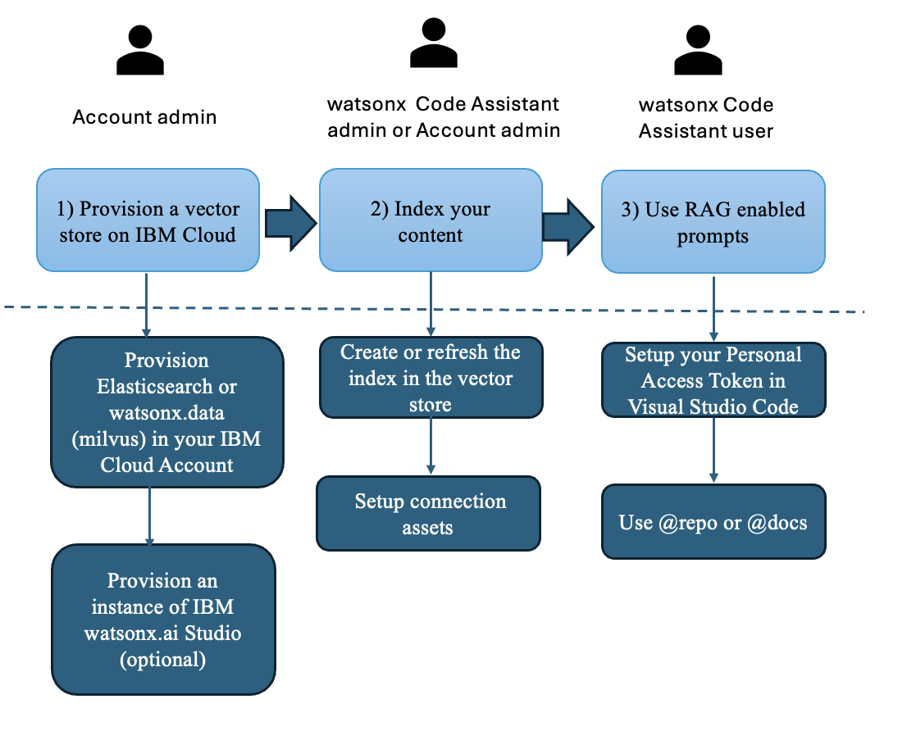

---

copyright:
   years: 2025
lastupdated: "2025-07-28"

keywords:

subcollection: watsonx-code-assistant

---

{{site.data.keyword.attribute-definition-list}}

# Setting up retrieval augmented generation (RAG)
{: #rag-overview}

[{{site.data.keyword.wca_short}}]{: tag-blue} [Standard plan]{: tag-purple} 

RAG is the process of optimizing the large language model (LLM) output through the prompt augmentation with the additional context. If you submit a query, {{site.data.keyword.wca_short}} uses the RAG tools to retrieve the information from your codebases or documentation. This relevant context is appended to the query before it is sent to the LLM model. The RAG system determines the sources that need to be included or excluded to generate a response with the most useful information.

RAG requires the {{site.data.keyword.wca_short}} Standard plan.
{: important}

{{site.data.keyword.wca_full_notm}} supports RAG that enhances response quality of user queries in relevant, up-to-date context from codebases and documentation. RAG reduces model hallucinations and improves the accuracy of generated responses.

You can configure {{site.data.keyword.wca_short}} with specific code repositories and project documentation that are not stored in the Git repository by using RAG to extract relevant information for the chat message. You can configure documentation such as API documents, readme files, technical and design documents, Markdown, PDFs, Word, and PowerPoint documents.

The following figure illustrates the procedure to configure RAG for {{site.data.keyword.wca_short}}:

{: caption="Procedure for setting up RAG in {{site.data.keyword.wca_short}}"}

## Enabling RAG
{: #rag-enable}

To enable RAG:

1. Provision a vector store on {{site.data.keyword.BluSoftlayer_notm}}.
   
   1. Provision a Milvus or Elasticsearch vector store instance on the {{site.data.keyword.BluSoftlayer_notm}}. If the vector store is already available on your {{site.data.keyword.BluSoftlayer_notm}}, you can skip this step.
      
      - To provision an Elasticsearch vector store instance, see [Provisioning Databases for Elasticsearch](/docs/databases-for-elasticsearch?topic=databases-for-elasticsearch-provisioning&interface=ui){: external}.

      - To provision a Milvus vector store instance, see [Provisioning watsonx.data](/docs/watsonxdata?topic=watsonxdata-getting-started){: external}.
        
        Milvus is a part of {{site.data.keyword.lakehouse_full_notm}}. You can provision a Milvus instance with the [watsonx.data enterprise plan](/docs/watsonxdata?topic=watsonxdata-getting-started_1){: external}.
        {: note}

   1. Optional: Provision an instance of IBM watsonx.ai Studio to index the code repository.

1. Index or refresh your code repositories in Milvus or Elasticsearch. For more information, see [Indexing code repositories with IBM watsonx.ai Studio](/docs/watsonx-code-assistant?topic=watsonx-code-assistant-rag-index-studio).

   Set up the connection assets:
   
   1. Use the existing deployment space in your {{site.data.keyword.wca_short}} service instance.

   1. Create a connection asset for each index that is created in the vector store. For more information, see [Creating a connection asset](/docs/watsonx-code-assistant?topic=watsonx-code-assistant-rag-wca-onboard#rag-connection).

1. Set up the Git personal access token in Visual Studio Code and use the RAG-enabled prompts.
   
   1. Click your profile icon in GitHub and go to **Settings** > **Developer Settings** > **Personal Access Tokens** > **Tokens (Classic)**. To create a new personal access token with the required permissions, see [Generate a new token](https://github.ibm.com/settings/tokens){: external}.
   1. Copy your personal access token. 
   1. In Visual Studio Code, click **View**, then click **Command Palette**.
   1. Search for `WCA`, then click **Enter GitHub Personal Access Token for WCA**.
   1. Enter your GitHub personal access token and press `Enter` or `Return`.   
   1. In chat messages, enter `@repo < instruction >` or `@docs < instruction >` to generate a response that uses the context from the referenced repository or documents in the vector store. Replace the `< instruction >` parameter with a prompt message. 
      
   - Sample syntax to use the referenced repository:
  
     ```text
     @repo how is a chat message processed?
     ```
     {: codeblock} 
   
     {{site.data.keyword.wca_short}} uses the indexed repositories based on the following conditions:

     - If one repository is opened in Visual Studio Code, {{site.data.keyword.wca_short}} searches for the context in the opened repository as default.

     - If multiple repositories are opened in Visual Studio Code, {{site.data.keyword.wca_short}} searches for the context from the repository that is associated with the recently accessed file.

     - {{site.data.keyword.wca_short_cap}}checks for the `repo.yaml` file in the indexed repository when you enter `@repo < instruction >` syntax in the chat. If one or more YAML configuration files are configured, {{site.data.keyword.wca_short}} uses all the configured repositories to generate a response. If YAML configuration is not configured, {{site.data.keyword.wca_short}} uses the selected repository. 
      
   - Sample syntax to use the referenced document collection:

     ```text
     @docs What are the steps to setup a connection to the user data store?
     ```
     {: codeblock} 

     {{site.data.keyword.wca_short_cap}} uses the indexed document collections based on the following conditions:

     - If the document is opened in Visual Studio Code, {{site.data.keyword.wca_short}} searches for the context in the opened repository as default.

     - If multiple document collections are opened in Visual Studio Code, {{site.data.keyword.wca_short}} searches for the context from the recently accessed document.

     - {{site.data.keyword.wca_short_cap}} checks for the `docs.yaml` file in the indexed repository when you enter `@docs < instruction >` syntax in the chat. If one or more YAML configuration files are configured, {{site.data.keyword.wca_short}} uses all the configured document collections to generate a response. If YAML configuration is not configured, {{site.data.keyword.wca_short}} uses all the document with the `docs_<filename>` name in your deployment space. 

   Optional: If you need to set up YAML configuration for indexed repositories or document collections, see [Setting up YAML configuration for RAG](/docs/watsonx-code-assistant?topic=watsonx-code-assistant-rag-overview#yaml-rag).

## Setting up YAML configuration for RAG
{: #yaml-rag}

You can set up YAML configuration optionally to allow {{site.data.keyword.wca_short}} to search for multiple repositories at the same time or use the specific indexed code repository or document in the vector store. If you do not set up YAML configuration, {{site.data.keyword.wca_short}} uses the repository that is opened in Visual Studio Code as default. 

{{site.data.keyword.wca_short}} uses the API key authorization method to ensure that you can access only the authorized repositories or document collections.
{: note}

To set up YAML configuration for specific indexed repository, complete the following steps:

1. Create a `.wca/repo` folder at the root level of the repository.

1. Create a YAML file with the following fields:
        
   ```shell
   repo:
      - url: git@github.ibm.com:code-assistant/<my-code>.git
   ```
   {: codeblock}

   If you need to configure {{site.data.keyword.wca_short}} with multiple repositories, create a `repo.yaml` file for each repository that needs to be used to generate a response. 
      
To set up YAML configuration for specific document collections, complete the following steps:

1. Create a `.wca/docs` folder at the root level of the repository.

1. Create a YAML file with the following fields:
        
   ```shell
   docs: 
      - url: my_collection
   ```
   {: codeblock} 
   
## Use case scenarios
{: #rag_usecase}

The use case scenarios explain how RAG works and how data is retrieved from indexed repositories or documents.

### Using a single code repository
{: #rag_usecase1}

If you are working in a single repository and want to use the code from this repository as context for chat conversations, complete the following steps:

1. Ensure that you have access to the repository in GitHub.

1. Index the repository in the vector store. For more information, see [Indexing code repository with IBM watsonx.ai Studio](/docs/watsonx-code-assistant?topic=watsonx-code-assistant-rag-index-studio)

1. Create a connection asset for the repository. For more information, see [Creating a connection asset](/docs/watsonx-code-assistant?topic=watsonx-code-assistant-rag-wca-onboard#rag-connection).

1. Generate a Git personal access token from your GitHub account and complete the setup in Visual Studio Code.

1. Open the repository in Visual Studio Code.

1. Use the `@repo` command in chat to generate a response that uses the context from the repository.

### Using multiple code repositories 
{: #rag_usecase2}

If you are working on a repository that has dependencies on another repository, you can use the code from both the repositories as context for chat conversations. To use both repositories, complete the following steps:

1. Ensure that you have access to both repositories in GitHub.

1. Index each repository in the vector store separately. For more information, see [Indexing code repository with IBM watsonx.ai Studio](/docs/watsonx-code-assistant?topic=watsonx-code-assistant-rag-index-studio).

1. Create two connection assets for each vector store. For more information, see [Creating a connection asset](/docs/watsonx-code-assistant?topic=watsonx-code-assistant-rag-wca-onboard#rag-connection).

1. Generate a Git personal access token from your GitHub account and complete the setup in Visual Studio Code.

1. In the first repository, set up the YAML configuration to list both repositories.

1. Use the `@repo` command in chat to generate a response that uses the context from both repositories.

If you use same index for both repositories, the GitHub access check is not used for the second repository. If you do not have access for one of the repositories, {{site.data.keyword.wca_short}} generates the context from the authorized repository only.
{: note} 

### Enabling all the users in a team to access project documentation repositories
{: #rag_usecase3}

You can allow all the users in a team to access the project documentation repositories and use the documents as context for chat conversations.

To enable access for all users:

1. Index the project documentation repositories in the vector store. For more information, see [Indexing code repository with IBM watsonx.ai Studio](/docs/watsonx-code-assistant?topic=watsonx-code-assistant-rag-index-studio). 

   You can use the same index for all documentation repositories if all the users have access for the indexed project documentation repositories. If the users have an access restriction for the indexed repository, see [Enabling the users in a different subteam to access project documentation repositories](/docs/watsonx-code-assistant?topic=watsonx-code-assistant-rag-overview#rag_usecase4).

1. Create a connection asset for the documentation index in the deployment space that includes all the users of the team. For more information, see [Creating a connection asset](/docs/watsonx-code-assistant?topic=watsonx-code-assistant-rag-wca-onboard#rag-connection).

1. Use the `@docs` command in chat to generate a response that uses the context from the documentation index.

The GitHub personal access tokens are not used to verify access to documentation content. You can combine several documentation repositories in the same index in the vector store. The documentation content is less restrictive than code repositories and a single index for all the documentation repositories simplifies the index management process. The authorization to access the documentation repositories is only allowed to the onboarded users in the deployment space.
{: note}

### Enabling the users in a different subteam to access project documentation repositories
{: #rag_usecase4}

In this use case, different subteams within a large team maintain the project documentation repositories. Access to the documentation repositories is restricted to the different subteams. Other subteams don't have access for these documentation repositories. 

To enable each subteam to access the related project documentation repositories:

1. Index the documentation repositories separately in the vector store. For more information, see [Indexing code repository with IBM watsonx.ai Studio](/docs/watsonx-code-assistant?topic=watsonx-code-assistant-rag-index-studio).

1. Ensure that the deployment space is created for each subteam that includes its users.

1. For each documentation repository index, create a connection asset in the related deployment space. For more information, see [Creating a connection asset](/docs/watsonx-code-assistant?topic=watsonx-code-assistant-rag-wca-onboard#rag-connection).

1. Use the `@docs` command in chat to generate a response that uses the context from the documentation index.

{{site.data.keyword.wca_short_cap}} uses the respective documentation repository index based on the deployment space that is assigned to the users. The client-side configuration is not required.

### Enabling role-based users to access project documentation repositories
{: #rag_usecase5}

In this use case, users in a team require access to different sets of documentation based on their roles. The scope of documentation that is used as context in varies across the users with no access restrictions. For example, developers need technical and API documentation only, while business analysts focus on business process documents.

To customize the documentation repositories that are used as context:

1. Index each documentation repository in the vector store separately. For more information, see [Indexing code repository with IBM watsonx.ai Studio](/docs/watsonx-code-assistant?topic=watsonx-code-assistant-rag-index-studio).

1. Create a connection asset for each index in the deployment space of the team. For more information, see [Creating a connection asset](/docs/watsonx-code-assistant?topic=watsonx-code-assistant-rag-wca-onboard#rag-connection).

1. Set up YAML configuration for the required documentation index that is used as context. If you need to use multiple documentation indexes, set up YAML configuration for each documentation index.

1. Use the `@docs` command in chat to generate a response that uses the context from the documentation index.
