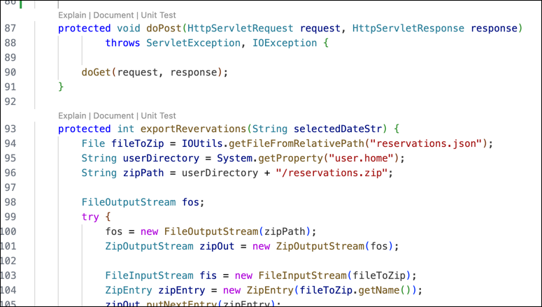

---

copyright:
   years: 2024, 2025
lastupdated: "2025-03-05"

keywords:

subcollection: watsonx-code-assistant

---

{{site.data.keyword.attribute-definition-list}}

# Documenting code
{: #wca-generate-doc}

[{{site.data.keyword.wca_short}}]{: tag-blue}

Generate comment lines that document what your code does.
{: shortdesc}

## Language support and standards
{: #wca-generate-doc-languages}

The following table lists code languages and the corresponding documentation standard for each code language.

| Code | Documentation standard |
| --- | --- |
| C | doxygen |
| C++ | doxygen |
| Go | GoDoc |
| Java | Javadoc |
| JavaScript | JSDoc |
| TypeScript | JSDoc |
| All others | Markdown |
{: caption="Documentation standards" caption-side="bottom"}

## Using a chat command to generate documentation
{: #wca-generate-doc-chat-command}

You can use the `/document` command in chat to generate documentation for a referenced file or a method or a class in the active workspace.

Use this syntax:

`/document <code reference> [additional instructions]`

- For `<code reference>`, type the `@` symbol to see a list of files, classes, and methods from your workspace. Use one file, method, class reference at a time.

- The `[additional instructions]` are optional. Add instructions if you want specific details.

## Using the CodeLens in the editor to generate documentation
{: #wca-generate-doc-document-option}

In the IDE editor, the CodeLens shows a line of generative AI options that precedes code blocks and snippets.  

1. Click the **Document** option that immediately precedes a code block or snippet to generate its documentation.

   In the following code example, the `Explain | Document | Unit Test` options immediately precede the `protected void` keywords.

   {: caption="CodeLens example"}

1. The {{site.data.keyword.wca_short}} chat window opens, displays the `/document @<*item name*>` command, runs the command, and displays the code with documentation added as comments.
