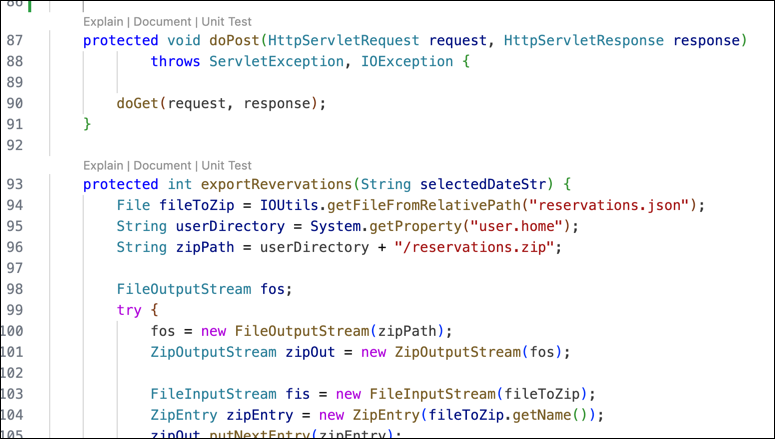

---

copyright:
   years: 2024
lastupdated: "2024-12-09"

keywords:

subcollection: watsonx-code-assistant

---

{{site.data.keyword.attribute-definition-list}}

# Generating unit tests
{: #wca-generate-test}


[{{site.data.keyword.wca_short}}]{: tag-blue}

Generate unit tests for various programming languages from the chat, the CodeLens in the editor, or the context menu.
{: shortdesc}

The following table lists the type of unit test for each plan.

| Plan | Unit test | Description |
| --- | --- | --- |
| [Trial plan]{: tag-magenta} [Essentials plan]{: tag-green} | Basic | Uses generative AI to provide a basic explanation. No extra code analysis is required. |
| [Standard plan]{: tag-purple} | Enhanced | Requires a built application, and uses a code analysis and generative AI to provide an enhanced code explanation for Java methods and classes. |
{: caption="Explanation types" caption-side="bottom"}

## Language support 
{: #wca-generate-test-languages} 

Test generation is available for the following languages:

{{site.data.content.language-support}}

{{site.data.content.time-list}}

## Dependencies
{: #wca-generate-test-dependencies}

[Standard plan]{: tag-purple} For Java, make sure that the `pom.xml` file includes the following dependencies:
- JUnit
- Mockito - A minimum of Java 9 is required

The following sample `pom.xml` file shows the dependencies with example versions. In your file, include the dependencies and versions that you are using.
 
```code  
   <dependencies>
      <dependency>
         <groupId>org.junit.jupiter</groupId>
         <artifactId>junit-jupiter-api</artifactId>
         <version>5.10.0</version>
         <scope>test</scope>
      </dependency>
      <dependency>
         <groupId>org.mockito</groupId>
         <artifactId>mockito-core</artifactId>
         <version>5.12.0</version>
         <scope>test</scope>
      </dependency>
      <dependency>
         <groupId>org.mockito</groupId>
         <artifactId>mockito-junit-jupiter</artifactId>
         <version>5.12.0</version>
         <scope>test</scope>
      </dependency>
   </dependencies>
```

## Using a chat command to generate a unit test
{: #wca-gen-chat}

You can use the `/unit-test` command in chat to generate a test for a referenced class, file, function, or method in the active workspace.

Use this syntax:

`/unit-test <code reference> [additional instructions]`

For `<code reference>`, type the `@` symbol to see a list of classes, files, functions, and methods from your workspace. Use one class, file, function, or method reference at a time.

The `[additional instructions]` are optional. Add instructions if you want specific details.

Example prompts:
- File: `/unit-test @OrdersAlertFilter.java`
- Class: `/unit-test @OrdersAlertFilter`
- Method: `/unit-test @DoFilter()`  

Next, {{site.data.keyword.wca_short}} processes the request and in the chat displays the generated unit test for the code that you selected. 

* [Essentials plan]{: tag-green} Copy the unit test to a file where you have unit tests for your application.

* [Standard plan]{: tag-purple} Copy the unit test to a file in the `/test` subfolder. For example, copy the unit test file to `.../src/main/test/java/com/acme/modres/OrdersAlertFilter.java`. 

## Using the CodeLens in the editor to generate unit tests
{: #wca-gen-option}

In the IDE editor, the CodeLens shows a line of generative AI options that precedes code blocks and snippets.  

{{site.data.content.codelens-delay}}

1. Click the **Unit Test** option that immediately precedes a code block to generate a unit test. 

   In the following code example, the `Explain | Document | Unit Test` options immediately precede the `protected void` keywords.

   {: caption="CodeLens example"}
{: #codelens-image}

   The {{site.data.keyword.wca_short}} chat window opens, displays the `/unit-test @<*item name*>` command, runs the command, and displays the unit test.

1. [Essentials plan]{: tag-green} Copy the unit test to a file where you have unit tests for your application.

1. [Standard plan]{: tag-purple} Copy the unit test to a file in the `/test` subfolder. For example, copy the unit test file to `.../src/main/test/java/com/acme/modres/OrdersAlertFilter.java`.

## Generating unit tests from the context menu
{: #wca-gen-context}

To generate a unit test from a context menu:

1. In the Explorer view, expand your application to the code that you want to generate a unit test for.

1. Right-click the code, click **{{site.data.keyword.wca_short}}**, then click **Unit Test**.

1. The {{site.data.keyword.wca_short}} chat displays the `/unit-test` command for the code that you selected for unit testing. The following syntax is used in the command:

   `/unit-test @<*item syntax*>`

   The following syntax examples are for a file, a class, and a method.

   * File: `/unit-test @OrdersAlertFilter.java`
   * Class: `/unit-test @OrdersAlertFilter`
   * Method: `/unit-test @DoFilter()`


   {{site.data.keyword.wca_short_cap}} processes the request and in the chat displays the generated unit test for the code that you selected. 

1. [Essentials plan]{: tag-green} Copy the unit test to a file where you have unit tests for your application.

1. [Standard plan]{: tag-purple} Copy the unit test to a file in the `/test` subfolder. For example, copy the unit test file to `.../src/main/test/java/com/acme/modres/OrdersAlertFilter.java`.
