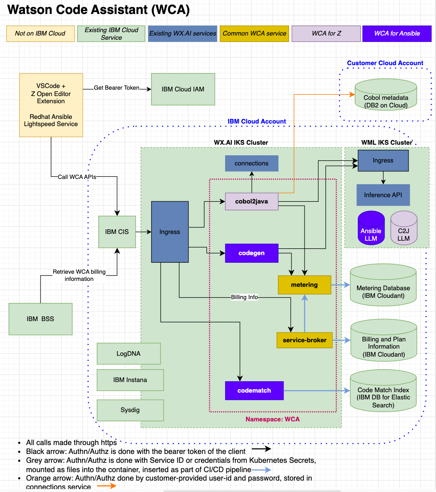

---

copyright:
  years: 2023
lastupdated: "2023-10-10"

keywords:

subcollection: watson-code-assistant

---

{{site.data.keyword.attribute-definition-list}}

# Learning about watsonx Code Assistant architecture and workload isolation
{: #compute-isolation}

Review the following sample architecture for {{site.data.keyword.wca_full}}, and learn more about different isolation levels so that you can choose the solution that best meets the requirements of the workloads that you want to run in the cloud.
{: shortdesc}

## {{site.data.keyword.wca_full_notm}} architecture
{: #architecture}

The following architectural diagram illustrates the architecture of {{site.data.keyword.wca_full_notm}}.

{: caption="Architectural diagram for WCA"}

[watsonx Code Assistant for Z]{: tag-purple}

**Note**: For {{site.data.keyword.wca_full_notm}} for Z, you're responsible for supplying your own instance of Db2 on IBM Cloud as established while [Getting started](./getting-started.md).

<!-- ## {{site.data.keyword.wca_full_notm}} workload isolation
{: #workload-isolation}

_Document how customer workloads are isolated from each other by plan. Do customer workloads run within the customer account?  Are customer workloads isolated within Kubernetes namespaces? Do customer workloads run on dedicated compute? Check out the example from Kubernetes: https://cloud.ibm.com/docs/containers?topic=containers-service-arch#worker-components_ -->
